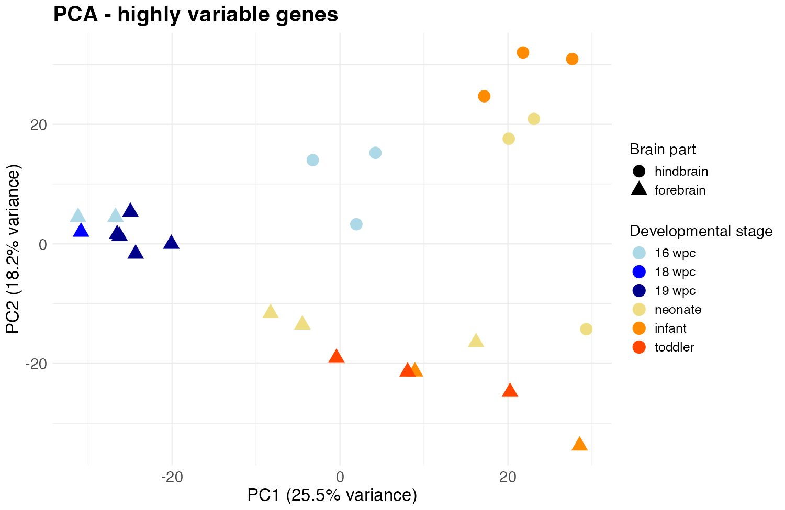
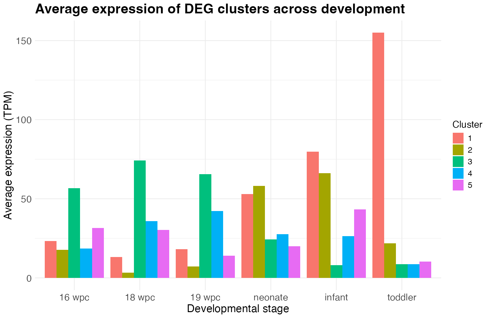
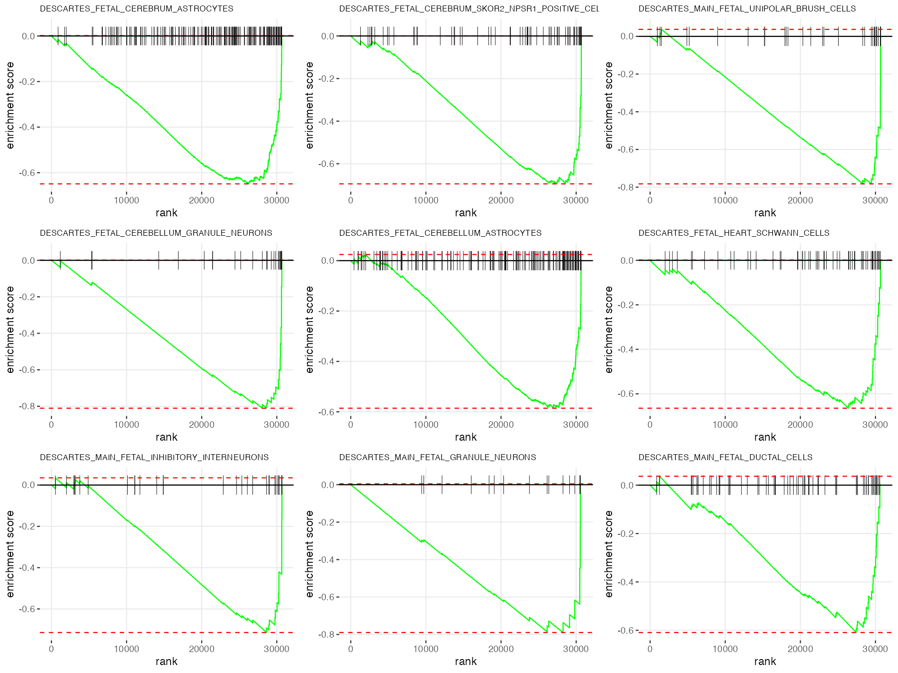

# Gene expression in the human forebrain and hindbrain before and after birth

Bulk RNA-seq analysis of 25 human brain samples from
[Cardoso-Moreira et al., *Nature* 2019](https://doi.org/10.1038/s41586-019-1338-5),
spanning 16 weeks post conception (wpc) to toddler age. The analysis asks which
genes change across developmental stages, how they group into expression
trajectories, and which cell type signatures separate forebrain from hindbrain.

Course project for *Systems Genomics* (MSc Computational Biology and
Bioinformatics, autumn 2024) by Nicola Zolliker and Axelle Colliquet.

## Data

Public data from ENA/SRA project [PRJEB26969](https://www.ebi.ac.uk/ena/browser/view/PRJEB26969):
single-end, poly-A selected RNA-seq, Illumina HiSeq 2500, 101 bp.

| Stage   | Forebrain | Hindbrain |
|---------|----------:|----------:|
| 16 wpc  | 2         | 3         |
| 18 wpc  | 1         | –         |
| 19 wpc  | 5         | –         |
| neonate | 3         | 3         |
| infant  | 2         | 3         |
| toddler | 3         | –         |

Run accessions are listed in `R_analysis/SRR_Acc_List.txt`, sample metadata in
`R_analysis/SraRunTable.txt`.

## Methods

**Pre-processing** was run on a compute cluster and its scripts are not part
of this repository: read quality control with FastQC, alignment to hg38 with
STAR (about 90% of reads mapped in every sample), and gene/isoform
quantification with RSEM. `R_analysis/make_gene_tables.R` documents how the
RSEM output was collapsed into the gene-level tables in `R_analysis/data/`
(TPM, expected counts and average transcript lengths per gene and sample).

**Analysis** (`R_analysis/analysis.R`):

1. **Filtering.** Genes detected in at least half of the samples or with mean
   TPM ≥ 1 are kept (30,941 of 61,852).
2. **Sample similarity.** Hierarchical clustering on Pearson and Spearman
   correlation, and PCA on log-transformed TPM.
3. **Highly variable genes.** Genes whose squared coefficient of variation
   exceeds a fitted mean-dependent trend (BH-adjusted p < 0.01): 1,755 genes.
4. **Differential expression across stages**, with brain part as covariate, on
   the highly variable genes, using two approaches:
   - a per-gene linear model on log(TPM + 1) with an F-test against the model
     without stage (ANCOVA), Holm-adjusted;
   - a DESeq2 likelihood-ratio test on RSEM counts imported with tximport.
5. **Expression trajectories.** DESeq2 hits are clustered by Spearman
   correlation of their mean expression per stage (complete linkage, 5 clusters).
6. **Gene set enrichment.** Genes are ranked by a DESeq2 likelihood-ratio test
   for brain part (stage as covariate, all expressed genes) and tested against
   the MSigDB C8 cell type signatures with fgsea.

## Results

**Developmental stage and brain part both structure the data.** On the highly
variable genes, the first two principal components explain 43.7% of the
variance. Prenatal forebrain samples form a tight group, postnatal samples
spread along PC1, and hindbrain samples separate from forebrain along PC2.

**Most highly variable genes change with developmental stage.** DESeq2 calls
1,000 of the 1,755 genes at an adjusted p-value below 0.1. The linear model with
Holm correction and a two-fold change threshold calls 103. Under comparably
strict family-wise corrections, 95 genes are significant in both tests, 249 only
with DESeq2 and 8 only with the linear model; the p-values of the two tests
correlate with a Spearman coefficient of 0.76.

**Stage-dependent genes fall into distinct trajectories.** Cluster 1
(345 genes) rises after birth and peaks in toddlers, cluster 2 (358 genes)
peaks in neonates and infants, and cluster 3 (193 genes) is high before birth
and drops afterwards. Clusters 4 and 5 are small (61 and 43 genes) and less
clearly shaped.

**Cell type signatures recover the expected regional identities.** Of 616 gene
sets tested, 118 are significant at an adjusted p-value below 0.05. Signatures
of cortical excitatory neurons and prefrontal cortex cell types are enriched in
forebrain; cerebellar granule neurons, unipolar brush cells and cerebellar
astrocytes are enriched in hindbrain.

All figures are in `R_analysis/figures/`, tables in `R_analysis/results/`.

## Limitations

- The design is unbalanced: there are no hindbrain samples at 18 wpc, 19 wpc or
  toddler age, so stage and brain part cannot be separated cleanly.
- Sex and donor are not modelled.
- Differential expression across stages is tested only on the pre-selected
  highly variable genes, which inflates the fraction of significant genes.
- The DESeq2 volcano plot shows the fold change between the last and the first
  stage, while its p-value tests all stages jointly.

## Notes

The workflow follows the RNA-seq tutorial of the course, and parts of the code
are adapted from it, in particular `estimate_variability()` and `DE_test()`.
The choice of data set and question, the comparison of the two tests, the
trajectory clustering and the interpretation are our own.

The analysis was originally done interactively and rewritten as a single script
in October 2026. The rewrite fixed two errors: samples were passed to DESeq2 in
a different order than their metadata, and dendrogram leaves and volcano plot
points were labelled in table order instead of their own order. Numbers and
figures here therefore differ from the original course presentation.
